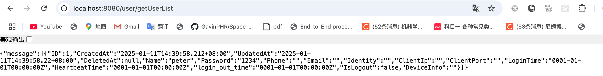
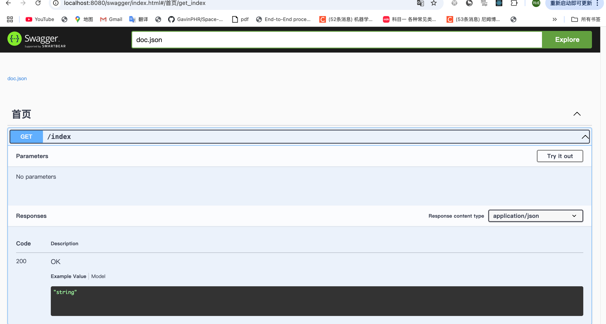

1. 引入gorm

2. dev 搜 gin

3. 阶段性达成


4. swag init 终端命令
export PATH=$PATH:~/go/bin  才能使用swag命令

安装gin-swagger
go get -u github.com/swaggo/gin-swagger
go get -u github.com/swaggo/files



5. 自定义日志模版 打印SQL语句
	// logger.New(writer, config)
	newLogger := logger.New(
		// 创建一个将会把日志输出到标准输出，
		// 每条日志消息前面会有一个回车换行符以及标准的时间戳格式（包括日期和时间）的 Logger 对象
		log.New(os.Stdout, "\r\n", log.LstdFlags),
		logger.Config{
			SlowThreshold: time.Second, // 慢SQl阈值
			LogLevel: logger.Info, // 日志对应级别
			Colorful: true, // 日志为彩色
		},
	)

6. crud user
```
func GetUserList() []*UserBasic {
	data := make([] *UserBasic, 10)
	utils.DB.Find(&data)
	for _, v := range data {
		fmt.Println(v)
	}
	return data
}

func CreateUser(user UserBasic) *gorm.DB {
	return utils.DB.Create(&user)
}

func DeleteUser(user UserBasic) *gorm.DB {
	return utils.DB.Delete(&user)
}

func UpdateUser(user UserBasic) *gorm.DB {
	return utils.DB.Model(&user).Updates(UserBasic{Name: user.Name, Password: user.Password})
}
```

6. gorm出现incorrect datetime value '0000-0 00:00:00:00'for column问题
因为mysql的8.0以上版本不支持零日期格式,导致gorm插入默认数据出错
解决方法一:修改代码中struct
1、把日期类型time.Time改为指针类型*time.Time
2、设置数据库日期可以为null

7. 解决git 去除本地代理


8. 校验
结构体字段后面加校验规则
https://github.com/asaskevich/govalidator

9. 用户名、手机号不能重复注册
```
func FindUserByName(name string) *gorm.DB{
	user := UserBasic{}
	return utils.DB.Where("name=?", name).First(&user) // ? 占位符不能丢
}
```
或者这么返回
```
func FindUserByEmail(email string) UserBasic{
	user := UserBasic{}
	utils.DB.Where("email=?", email).First(&user)
	return user
}
```